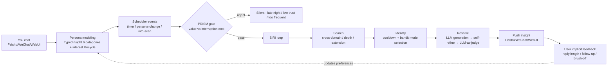
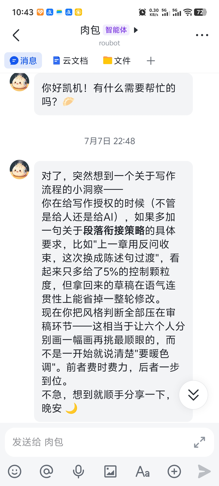
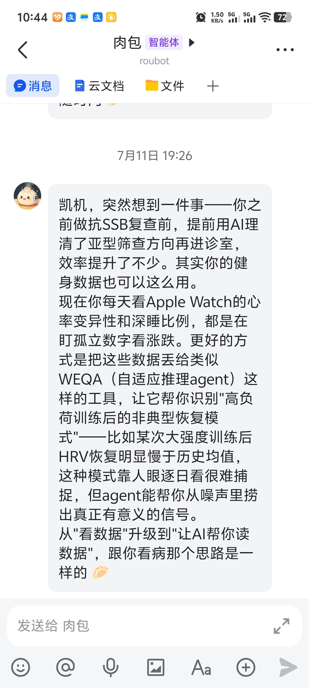
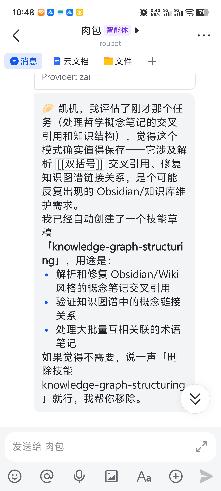
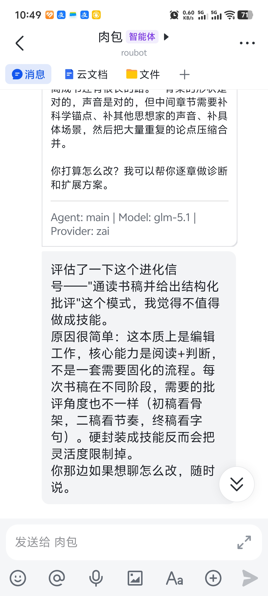
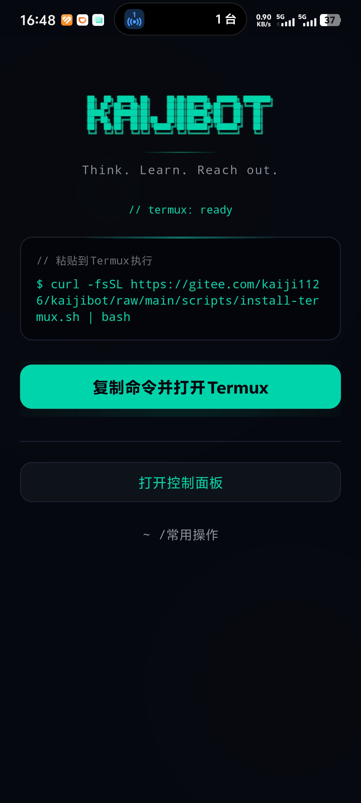
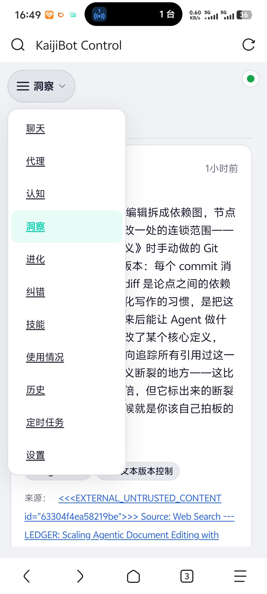
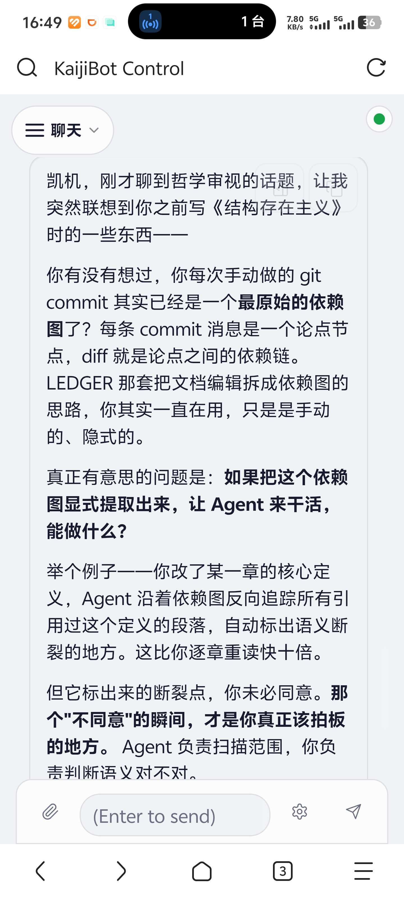
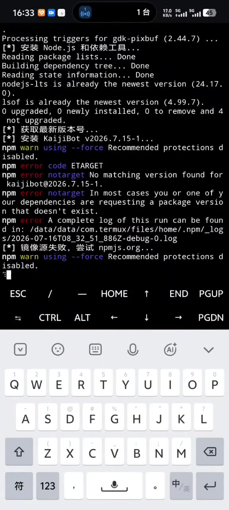

# KaijiBot 👾

> **Your AI assistant reaches out to you — not the other way around.**

The first open-source AI companion that turns "proactive cognition" into a system-level capability · Pushes insights to you · Continuously models you · Agent autonomously evolves its own skills · Never makes the same mistake twice · Runs locally on Android phones

[](LICENSE)
[](https://nodejs.org/)
[](https://www.typescriptlang.org/)]

[English](./README.en.md) | [简体中文](./README.md)

## Why KaijiBot

Every AI assistant you've used follows the same pattern: you ask, it answers. You stop asking, it goes silent.

KaijiBot is different. After a few conversations on Feishu, it starts **reaching out to you** proactively — not with spam or hydration reminders, but with things you'd actually find interesting.

| Capability | Typical chatbot | Typical memory agent (2026) | **KaijiBot** |
| --- | --- | --- | --- |
| **Interaction** | Reactive — you ask, it answers | Reactive + long memory | **Pushes insights proactively** + normal Q&A |
| **User modeling** | Stateless | Vector DB + rerank | **TypedInsight 6 categories + category-aware decay half-lives + interest lifecycle** |
| **Timing awareness** | Doesn't care what you're doing | None | **PRISM cost-sensitive gating** (no late-night interruptions, restraint during low trust) |
| **Self-evolution** | None | None | **Agent autonomously creates/deletes skills** (code makes no quality judgments) |
| **Correction learning** | None | None | **Dual-path correction memory** (never makes the same mistake twice) |
| **Deployment** | Cloud SaaS | Cloud SaaS | **Cloud / local / Android phone local** (Termux, full agent, not a thin client) |

> Channel integration: Feishu · WeChat (first-class channels, deep support); 18 additional channels bundled from upstream (Telegram/Discord/Slack etc., not deeply tested). EN/zh CLI / wizard / cognitive prompts auto-switch. 40+ LLM providers pluggable.

## ✨ Core Features

### 🔮 Cognitive Engine — From Reactive Replies to Proactive Insights

KaijiBot is not a reactive tool — it's a **continuously running cognitive entity that models you and pushes insights when the moment is right**. Its proactive insight pipeline:



Five core mechanisms:

- **Persona Profiling** — Every conversation teaches it something new. LLM-driven structured extraction automatically discovers domains and interests from conversations. Insights decay by category independently (`tool_config` 7d / `domain_knowledge` 30d / `behavioral_pattern` 90d...). Interest lifecycle is tracked automatically (emergent→stable→declining→dormant→revived). Domain names discovered dynamically by LLM — no hardcoded keywords.
- **Cross-Domain Insights** — You're interested in both A and B, it finds potential connections. You asked about something before but didn't dig deeper, it follows up from a new angle. You've gone deep enough in one area, it suggests extension directions. LLM self-refine loop (critique→rewrite, up to 3 rounds) ensures quality, semantic dedup ensures every push is fresh.
- **Timing Gate** — It doesn't push whenever it feels like it. The PRISM model calculates expected value for each insight. Only pushes when expected benefit exceeds interruption cost. No late-night interruptions, restraint during low trust, waits if you've been inactive.
- **Trust Evolution** — Cautious at first, understands you better over time, eventually becomes a confident partner who can make bold recommendations. SARA framework drives four-stage trust evolution. Trust level determines what the system is allowed to do.
- **Preference Learning** — You wrote a long reply? It notes you like this topic. You gave a one-word response? It tries a different direction next time. Thompson Sampling-driven preference learning. Implicit feedback is more honest than explicit feedback.

Insight content is generated from your profile + LLM knowledge + real-time web search. With a search API key, insights stay current.

**💡 Real insight samples (actual Feishu messages from the operator's own KaijiBot instance)**

The two screenshots below are real Feishu messages KaijiBot pushed to the operator during long-term use. **Not fabricated, not GPT examples, actual system output.**

<table>
<tr>
<td width="33%" valign="top">
<strong>Sample 1: Behavioral pattern insight</strong><br>
<sub>KaijiBot noticed the operator repeatedly deferring "style judgment" to the review stage, and proactively suggested moving that judgment upstream into the delegation stage (pushed 2026-07-07 22:48)</sub>
<br><br>

</td>
<td width="33%" valign="top">
<strong>Sample 2: Cross-domain connection</strong><br>
<sub>KaijiBot migrated the operator's prior pattern of "using AI to assist medical consultations" onto "using AI to interpret Apple Watch fitness data", building a bridge between two domains (pushed 2026-07-11 19:26)</sub>
<br><br>

</td>
<td width="33%"></td>
</tr>
</table>

Note the tone — it doesn't read like a cold "notification" or "suggestion", but **like a friend casually sharing a thought**. This isn't a prompt-injected personality; it's the conversational style tuned by Persona implicit-preference learning + Thompson Sampling.


### 🧬 Self-Evolution — Agent Decides When to Learn New Skills

You've done several complex Feishu knowledge base operations with KaijiBot — searching meeting records, extracting minutes, creating documents, setting tasks. KaijiBot notices this workflow is repetitive and complex, and tells you:

> "I noticed you've been doing similar meeting minute archiving workflows recently. I wrote myself a skill — next time you say 'archive meetings', I'll execute the entire flow automatically."

How it works:

- **Hard Trigger Detection** — Code does noise filtering only, no quality judgments. After detecting complex tasks (≥3 tool calls), a system event is injected.
- **Agent-Driven Decision** — The Agent has full conversation context and decides whether it's worth creating a skill. Not worth it? Ignored.
- **Full Lifecycle** — Dedup check before creation, usage frequency tracking after, auto-cleanup for unused skills (30 days + 0 usage).

**🧬 Real samples — two opposite outcomes from Agent autonomous decision-making**

The two screenshots below show opposite decisions the Agent made during the operator's real use. **This is living proof of the "code makes no quality judgments" architectural claim** — most "self-evolving agents" will blindly create a skill for every complex task. KaijiBot's Agent judges for itself whether something "deserves to be solidified into a workflow".

<table>
<tr>
<td width="33%" valign="top">
<strong>Decision 1: Agent decides to create a skill</strong><br>
<sub>After the operator processed a batch of Obsidian philosophy-concept notes' cross-references, the Agent evaluated that this pattern would recur and proactively created a <code>knowledge-graph-structuring</code> skill, explaining its uses and how to delete it</sub>
<br><br>

</td>
<td width="33%" valign="top">
<strong>Decision 2: Agent decides NOT to create a skill</strong><br>
<sub>The operator asked the Agent to read through a manuscript and give structured criticism. The Hard Trigger fired the same evolution signal, but the Agent judged for itself "this is fundamentally editing work, the core capability is reading+judgment, not a process; hard-codifying it would actually limit flexibility" and <strong>proactively refused</strong> to create the skill</sub>
<br><br>

</td>
<td width="33%"></td>
</tr>
</table>

Note evo2 — the Agent's refusal reason is substantive (first draft = structure, second draft = pacing, final draft = word choice), not a templated "I can't do this". This ability to "say no on its own" is a direct product of the "code only does noise filtering, Agent judges everything" architecture.

### 🔄 Correction Self-Evolution — Never Makes the Same Mistake Twice

AI assistant making the same mistake every new session? KaijiBot won't. It has a correction memory system that ensures every mistake is made at most once.

- **Dual-Path Detection** — Agent self-reports errors, or the system automatically extracts corrections from conversations at session end.
- **Dedup + Reinforcement** — Repeated errors don't create new records; they increase weight, ensuring high-frequency issues get priority.
- **System Prompt Injection** — Corrections are injected into the system prompt that the Agent sees every turn, rather than in files that may not be read.

Step into a pit once. That's enough.

### 🔌 Pluggable Architecture

Not locked into any single provider. Switch between domestic and international at will. `kaijibot onboard` wizard auto-discovers configured API keys.

| China                                          | International                                   | Aggregator / Self-hosted                           |
| ---------------------------------------------- | ----------------------------------------------- | -------------------------------------------------- |
| DeepSeek · Qwen · Kimi · MiniMax · Zhipu GLM … | Claude · Gemini · Grok · Mistral · Perplexity … | OpenRouter · Together · Ollama · LMStudio · vLLM … |

Switch models with a single command:

```bash
kaijibot config set agent.model "deepseek/deepseek-chat"
kaijibot config set agent.model "anthropic/claude-sonnet-4-20250514"
```

### 🌐 Auto Locale Switching (EN / zh)

CLI output, onboarding wizard, and cognitive layer prompts all switch automatically based on system language:

- **CLI** — Detects `LANG` / `LC_ALL` environment variables. Banner, help text, command descriptions, wizard dialogue all switch between English and Chinese.
- **Cognitive Layer** — Based on `preferredLanguage` in the user's Persona, insight generation prompts, correction injection, and evolution signals are all locale-aware.
- **Docs** — Automated translation pipeline for 13 languages (zh / ja / ko / es / pt-BR / de / fr / ar / it / tr / uk / id / pl).

```bash
export LANG=en_US.UTF-8   # English
export LANG=zh_CN.UTF-8   # Chinese
# Or override explicitly:
export KAIJIBOT_CLI_LOCALE=en
```

### 🛠️ Full Agent

**Agent Loop**: Reason → Call tools → Observe → Continue reasoning. Supports streaming, context compression, parallel sub-agent dispatch. Built-in tools include code execution, web scraping, PDF operations, image/video/music generation, TTS synthesis, Canvas, and more.

**Memory System**: Multiple storage backends with semantic search over conversation history. Three complementary systems maintain Agent context: session memory, daily consolidation, and manual organization.

- **Session memory** — Auto-generates structured summaries (decisions, todos, topics) at the end of each conversation. Archives by date into `memory/YYYY-MM-DD.md`, splits by topic into independent topic files. 8KB budget auto-balances: high-frequency content inlined, low-frequency content kept as pointers.
- **Daily consolidation** — Scheduled scan of historical sessions. LLM extracts structured knowledge (domains, behavioral patterns, preferences, goals), Jaccard-dedups, and routes into Persona profile, Fragment store, and Correction store. Your cognitive model evolves every day.
- **Smart retrieval** — Dual-engine: FTS full-text + sqlite-vec vector semantic search (requires an embedding provider). Hybrid retrieval balances keyword matching and semantic relevance.
- **Manual organization** — Built-in `memory-organize` skill: 4-step flow — GC (clean expired) → deep scan (find missed) → tidy dedup (cross-file) → budget check (stay lean).

**Skill Marketplace**: Dozens of built-in skills (github, weather, summarize, coding-agent, notion, obsidian, taskflow, and more). Install additional skills from ClawHub:

```bash
kaijibot skills install <skill-name>
```

### 📱 Runs Locally on Android — Put Your AI Companion in Your Pocket

Most AI assistants are either cloud SaaS (data leaves your device) or self-hosted projects that require a server. **KaijiBot can be installed directly on an Android phone, running the full agent locally** — not a thin client connecting back to your server, the phone itself is the agent.

**Just download one APK — no laptop, no command line, no GitHub account needed.** The [KaijiBot Launcher APK](https://github.com/Kaiji-Z/kaijibot/releases/tag/launcher) (~41MB, bundles Termux inside) walks you through every step.

**Three steps:**

1. **Download `kaijibot-launcher.apk`** — from the [GitHub Release](https://github.com/Kaiji-Z/kaijibot/releases/tag/launcher) to your phone
2. **Install the APK** (allow "unknown sources") — open the Launcher, it auto-installs the bundled Termux
3. **Tap "复制命令并打开 Termux" (Copy command and open Termux)** — long-press in Termux to paste, hit enter, KaijiBot auto-installs and starts

Launcher home screen, control panel, and a real mobile conversation — three screenshots side by side:

<table>
<tr>
<td width="33%" valign="top">
<strong>Launcher home screen</strong><br>
<sub>What you see when you open the APK — KaijiBot branding + a one-tap button that installs Termux and guides you through the rest</sub>
<br><br>

</td>
<td width="33%" valign="top">
<strong>Control panel (full cognitive system)</strong><br>
<sub>After launch, KaijiBot Control runs in the phone's browser. Every item in the left nav is a real UI entry for a cognitive subsystem: <strong>聊天 / 代理 / 认知 / 洞察 / 进化 / 纠错 / 技能 / 使用情况 / 历史 / 定时任务 / 设置</strong> (Chat / Agent / Cognition / Insights / Evolution / Corrections / Skills / Usage / History / Scheduled tasks / Settings). The right pane shows the current insight with its source attribution (<code>Source: Web Search --- LEDGER: Scaling Agentic Document Editing...</code>), proving the knowledge-mode web search is actually working</sub>
<br><br>

</td>
<td width="33%" valign="top">
<strong>Real mobile conversation</strong><br>
<sub>Substantive content KaijiBot produced on-phone (analogizing Git commits to dependency graphs, discussing how Agent can assist with consistency-checking in philosophical writing). Not a toy demo — this is real output from a live session</sub>
<br><br>

</td>
</tr>
</table>

**Why this matters:**

- **Data never leaves the phone** — Conversation history, Persona profile, correction memory, skills — all stored locally on the phone. No third-party server in the middle.
- **Offline-capable** — As long as the LLM provider is reachable (fully offline via on-device Ollama / LAN vLLM), you have a portable AI companion. Cloud LLMs work too — traffic goes through your own API key.
- **Proactive insights via system notifications** — PRISM gating + Android notifications. KaijiBot pushes insights during your commute or lunch break, with the same UX as your daily Feishu/WeChat use.

**📱 Full run flow (26-second sped-up replay)**

Launch KaijiBot from phone home screen → open control panel → chat response (video sped up for quick preview; actual timing is longer):

<a href="./screenshot/Android5.mp4?raw=true" target="_blank" title="Click to play the 26-second sped-up replay in a new tab">
  
</a>

**[▶ Play the sped-up replay](./screenshot/Android5.mp4?raw=true)** (MP4, 4MB, plays in a new browser tab)

**Technical users who already have Termux** can skip the Launcher APK and run directly:

```bash
curl -fsSL https://github.com/Kaiji-Z/kaijibot/raw/main/scripts/install-termux.sh | bash
```

> Want to understand how the Launcher APK works under the hood, keep-alive configuration, or the Termux compatibility engineering? See [`android/README.md`](./android/README.md) and the [Termux deployment guide](./docs/platforms/termux.md).

## 🚀 Quick Start

### Preparation

Before you start, you'll need:

| Requirement | What for | How to get it                                                                                                                                                                                                                             |
| ----------- | -------- | ----------------------------------------------------------------------------------------------------------------------------------------------------------------------------------------------------------------------------------------- |
| **LLM API key** | At least one AI provider's key | [DeepSeek](https://platform.deepseek.com/) · [Claude](https://console.anthropic.com/) · [Gemini](https://aistudio.google.com/apikey) · [Qwen](https://dashscope.console.aliyun.com/) · [Kimi](https://platform.moonshot.cn/) — pick one |
| **Messaging channel** | For sending/receiving messages | [Feishu](https://open.feishu.cn/) (recommended, wizard supports QR-code auto-creation) · [WeChat](./docs/channels/) (first-class channel, run `kaijibot channels login --channel wechat` to connect) · 18 additional bundled channels (Telegram/Discord/Slack etc., not deeply tested) |

### Install (recommended)

**macOS / Linux** — one command:

```bash
curl -fsSL https://github.com/Kaiji-Z/kaijibot/raw/main/scripts/install.sh | bash
```

The script will: detect your system → install Node.js (if missing) → install KaijiBot → launch the config wizard.

**Windows** — PowerShell:

```powershell
iwr -useb https://github.com/Kaiji-Z/kaijibot/raw/main/scripts/install.ps1 | iex
```

After install, the wizard walks you through configuring LLM providers, Feishu bot, gateway, etc. The Feishu bot supports **QR-code auto-creation** (10 seconds, no manual setup on the open platform).

### Start

```bash
kaijibot gateway --port 18789 --verbose
```

Once started, find your bot in Feishu and send a message. KaijiBot automatically begins building your cognitive profile, and after a few rounds of conversation it'll push its first proactive insight.

<details>
<summary><b>📦 Other install methods</b></summary>

#### Android phone

Just download the [KaijiBot Launcher APK](https://github.com/Kaiji-Z/kaijibot/releases/tag/launcher) — three steps and you're done. See the [📱 Runs Locally on Android](#-runs-locally-on-android--put-your-ai-companion-in-your-pocket) section above.

#### npm global install (if you already have Node.js 22+)

```bash
npm install -g kaijibot
kaijibot onboard   # Interactive wizard, auto-configures
```

#### Docker

```bash
git clone https://github.com/Kaiji-Z/kaijibot.git
cd kaijibot
bash scripts/docker/setup.sh   # One-shot deploy script (recommended)
```

Or build manually:

```bash
git clone https://github.com/Kaiji-Z/kaijibot.git
cd kaijibot
docker build -t kaijibot:local .
# Create .env (see .env.example), at minimum:
#   ZAI_API_KEY=your-key
#   KAIJIBOT_GATEWAY_TOKEN=your-token
#   KAIJIBOT_CONFIG_DIR=~/.kaijibot
#   KAIJIBOT_WORKSPACE_DIR=~/.kaijibot/workspace
docker compose up -d
```

#### Build from source

```bash
git clone https://github.com/Kaiji-Z/kaijibot.git
cd kaijibot
pnpm install
pnpm build
kaijibot onboard   # Interactive wizard
# Migrating from OpenClaw? Run:
kaijibot migrate
```

</details>

### Configuration

**Required**: At least one LLM provider API key + at least one messaging channel credential.

```bash
# LLM API key — pick one provider, uncomment the corresponding line
# export DEEPSEEK_API_KEY="your-key"         # DeepSeek
# export ANTHROPIC_API_KEY="your-key"        # Claude
# export GOOGLE_API_KEY="your-key"           # Gemini
# export ZAI_API_KEY="your-key"              # Zhipu GLM

# Feishu channel (also configurable via wizard QR-code)
kaijibot config set channels.feishu.appId "your-app-id"
kaijibot config set channels.feishu.appSecret "your-app-secret"
```

**Optional**: Web search to enhance insight timeliness.

```bash
export EXA_API_KEY="your-key"
export TAVILY_API_KEY="your-key"
```

Config file at `~/.kaijibot/kaijibot.json`, supports hot reload. Cognitive system can be disabled via `cognitive.enabled: false`. For detailed configuration, see `AGENTS.md`.

## Relationship with OpenClaw

KaijiBot was originally forked from [OpenClaw](https://github.com/openclaw/openclaw)'s Gateway architecture and Plugin SDK boundaries. On top of that, we built an independent cognitive layer (proactive insights, self-evolution, correction memory) and rewrote the memory consolidation system. The foundation OpenClaw provides (Gateway, agent loop, tool ecosystem) lets us focus on the differentiated parts.

Base-layer engineering work (TypeBox type migration, pi-ai SDK upgrades, 1220 lint fixes, Windows/Android bug fixes, Plugin SDK backfill) is essentially invisible to users — see commit history for details.

> Want a slimmed-down experience? Set `cognitive.enabled: false` in config to disable the entire cognitive layer, falling back to the "hardened base + rewritten memory layer" state.

## Acknowledgments

KaijiBot stands on the shoulders of [OpenClaw](https://github.com/openclaw/openclaw) (built by Peter Steinberger and the community).

### Academic Research

The cognitive system design draws on the following research:

**Foundational Theory**

- Green, D. M., & Swets, J. A. (1966). _Signal detection theory and psychophysics_. Wiley.
- Thompson, W. R. (1933). On the likelihood that one unknown probability exceeds another in view of the evidence of two samples. _Biometrika_, 25(3/4), 285–294.
- Altman, I., & Taylor, D. A. (1973). _Social penetration: The development of interpersonal relationships_. Holt, Rinehart & Winston.
- Gentner, D. (1983). Structure-mapping: A theoretical framework for analogy. _Cognitive Science_, 7(2), 155–170.

**Human-Computer Relationships & Recommender Systems**

- Bickmore, T. W., & Picard, R. W. (2005). Establishing and maintaining long-term human-computer relationships. _ACM Transactions on Computer-Human Interaction_, 12(2), 293–327.
- Kotkov, D., Wang, S., & Veijalainen, J. (2016). A survey of serendipity in recommender systems. _Knowledge-Based Systems_, 111, 180–192.

**LLM Persona & Memory**

- DEEPER: Directed Persona Refinement. (2025). _Proceedings of ACL 2025_. 32.2% error reduction via active contradiction resolution in persona maintenance.
- PERSONAMEM: Persona-Aware Memory in LLMs. (2025). _Proceedings of COLM 2025_. Benchmark showing LLMs achieve ~50% accuracy on evolving profile tasks.
- DV365: Dynamic User Representations over 365 Days. (2025). _Proceedings of KDD 2025_. Instagram's multi-slicing user embedding architecture.
- GemiRec: Gemini-Powered Recommendations. (2025). Xiaohongshu's multi-interest vector architecture with codebook quantization.
- PIE: Personalized Interest Exploration. (2023). _Proceedings of WWW 2023_. Personalized PageRank with bandit exploration.
- ProfiLLM: Fully Implicit User Profiling from Chatbot Interactions. (2025).

### Open Source Dependencies

[Feishu Open Platform](https://open.feishu.cn/), [Vitest](https://vitest.dev/), [Playwright](https://playwright.dev/), [tsdown](https://github.com/nicepkg/tsdown), [Zod](https://zod.dev/).

## License

[MIT](LICENSE)
