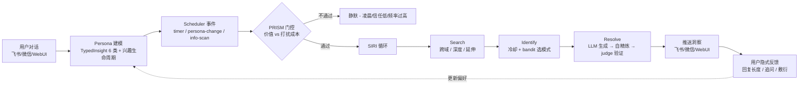

# KaijiBot 👾

> **你的 AI 助手会主动找你聊天，而不是干等着你提问。**

首个把"主动认知"做成系统级能力的开源 AI 伙伴 · 主动推送洞察 · 持续建模用户 · Agent 自主进化技能 · 同样的错误不犯第二次 · 可装进口袋在 Android 手机本地运行

[](LICENSE)
[](https://nodejs.org/)
[](https://www.typescriptlang.org/)

**README** | [English](./README.en.md) | **简体中文**

## 为什么是 KaijiBot

你用过的 AI 助手都一个模式：你问，它答。你不问，它就安静地待在那里。

KaijiBot 不一样。你在飞书里跟它聊了几次之后，它会开始**主动**给你发消息。不是广告，不是提醒喝水，而是你真正可能感兴趣的东西。

| 能力 | 普通 chatbot | 典型 memory agent (2026) | **KaijiBot** |
| --- | --- | --- | --- |
| **交互方式** | 你问它才答 | 被动响应 + 长记忆 | **主动推送洞察** + 正常对话 |
| **用户建模** | 无状态 | 向量库 rerank | **TypedInsight 6 类 + 类别衰减半衰期 + 兴趣生命周期** |
| **时机感知** | 不管你在干嘛 | 无 | **PRISM 成本敏感门控**(凌晨不打扰、信任低时克制) |
| **自我进化** | 无 | 无 | **Agent 自主创建/删除技能**(代码不做质量判断) |
| **纠错学习** | 无 | 无 | **双路径纠错记忆**(同样的错误不犯第二次) |
| **部署形态** | 云端 SaaS | 云端 SaaS | **云端 / 本地 / Android 手机本地运行**(Termux,完整 agent,非瘦客户端) |

> 渠道集成方面:飞书 · 微信(一等渠道,深度支持);另打包 18 个继承自上游的渠道(Telegram/Discord/Slack 等,未深度测试)。中英文 CLI / 向导 / 认知层 prompt 自动切换,40+ LLM 提供商可插拔。

## ✨ 核心特性

### 🔮 认知引擎 — 从被动回复到主动洞察

KaijiBot 不是一个被动响应的工具,而是一个**持续运行、对你建模、并在合适时机主动给你洞察**的认知实体。它的主动洞察流水线:



五个核心机制:

- **Persona 画像** — 每次对话都在学习你。LLM 驱动的结构化提取,从对话中自动发现领域和兴趣。洞察按类别独立衰减(`tool_config` 7天 / `domain_knowledge` 30天 / `behavioral_pattern` 90天...),兴趣生命周期自动追踪(emergent→stable→declining→dormant→revived)。领域由 LLM 动态发现,不依赖硬编码关键词。
- **跨域洞察** — 你同时关注 A 和 B,它发现二者有潜在联系。你之前问过但没深入的问题,它从新角度跟进。你在某个领域钻得够深了,它推荐延伸方向。LLM 自我精炼(critique→rewrite,最多 3 轮)保证质量,语义去重确保每次推送都有新意。
- **时机门控** — 不是想发就发。PRISM 模型计算每条洞察的期望价值,只有预期收益超过打扰成本时才推送。凌晨不打扰,信任度低时克制,你最近活跃度低就先等等。
- **信任演化** — 刚认识时谨慎试探,聊多了越来越懂你,最终变成可以大胆推荐的深度伙伴。SARA 框架驱动四个阶段的信任演化,信任等级决定系统被允许做什么。
- **偏好学习** — 你回复长了、追问了"为什么",它记下你喜欢这个话题。你敷衍了,它下次换一个方向。Thompson Sampling 驱动的偏好学习,隐式反馈比显式反馈更诚实。

洞察内容结合你的画像 + LLM 知识 + 实时网络搜索生成。配了搜索 API Key,洞察会紧跟时事。

**💡 真实洞察样例(运营者本人运行 KaijiBot 的实际飞书消息截图)**

以下两条是 KaijiBot 在长期运行中真实推送给运营者的飞书消息。**不是编造,不是 GPT 示例,是系统实际输出。**

<table>
<tr>
<td width="33%" valign="top">
<strong>样例 1:行为模式洞察</strong><br>
<sub>KaijiBot 注意到运营者反复把"风格判断"压在审稿环节,主动建议把判断前移到授权环节(2026-07-07 22:48 推送)</sub>
<br><br>

</td>
<td width="33%" valign="top">
<strong>样例 2:跨域连接</strong><br>
<sub>KaijiBot 把运营者之前"用 AI 辅助医疗就诊"的行为模式,迁移到"用 AI 辅助解读 Apple Watch 健身数据"上,建立两个领域之间的桥梁(2026-07-11 19:26 推送)</sub>
<br><br>

</td>
<td width="33%"></td>
</tr>
</table>

可以看到这些洞察的语气不是冷冰冰的"提醒"或"建议",而是**像一个朋友顺手分享一个想法**。这不是 prompt 硬塞的人格设定——是 Persona 画像里隐式偏好学习 + Thompson Sampling 调出来的对话风格。

### 🧬 自我进化 — Agent 自主判断何时学新技能

你跟 KaijiBot 连续做了几次复杂的飞书知识库整理操作——搜索会议记录、提取纪要、创建文档、设置任务。KaijiBot 发现这个流程重复且复杂，主动跟你说：

> "我注意到你最近几次都在做类似的会议纪要归档流程，我给自己写了个技能，以后你说'归档会议'我就自动执行整个流程。"

它怎么做到的：

- **Hard Trigger 检测** — 代码层只做噪音过滤，不做质量判断。检测到复杂任务后注入系统事件。
- **Agent 自主决策** — Agent 拥有完整对话上下文，自己判断是否值得做成技能。不值得就忽略。
- **完整生命周期** — 创建前去重检查、创建后跟踪使用频率、长期不用自动清理。

**🧬 真实样例 — Agent 自主决策的两种相反结果**

下面两条是运营者真实运行时 Agent 的两种相反决策。**这是"代码不做质量判断"架构声明的活证据** —— 大多数"自进化 agent"会无差别地为每个复杂任务创建技能,KaijiBot 的 Agent 会自己判断"这事该不该固化成流程"。

<table>
<tr>
<td width="33%" valign="top">
<strong>决策 1:Agent 决定创建技能</strong><br>
<sub>运营者处理了一批 Obsidian 哲学概念笔记的交叉引用,Agent 评估后认为这个模式会反复出现,主动创建了 <code>knowledge-graph-structuring</code> 技能,并解释了用途和删除方式</sub>
<br><br>

</td>
<td width="33%" valign="top">
<strong>决策 2:Agent 决定不创建技能</strong><br>
<sub>运营者让 Agent 通读书稿给结构化批评,Hard Trigger 同样触发了进化信号,但 Agent 自己判断"这本质是编辑工作,核心能力是阅读+判断,不是流程,硬封装反而限制灵活度",<strong>主动拒绝</strong>了技能创建</sub>
<br><br>

</td>
<td width="33%"></td>
</tr>
</table>

注意 evo2 这条 —— Agent 给出的拒绝理由是有内容的(初稿看骨架、二稿看节奏、终稿看字句),不是模板化的"我无法处理"。这种"自己说不"的能力,是"代码只降噪、Agent 全权判断"架构的直接产物。

### 🔄 纠错自进化 — 同样的错误不犯第二次

AI 助手每次新建会话都犯同样的错？KaijiBot 不会。它有一套纠错记忆系统，保证同样的错误只犯一次。

- **双路径检测** — Agent 自报错误，或会话结束时系统自动从对话中提取纠错记录。
- **去重 + 强化** — 重复的错误不会新建记录，而是增加权重，确保高频问题优先被看到。
- **系统提示注入** — 纠错记录注入到 Agent 每一轮都能看到的系统提示中，而不是放在可能不被读取的文件里。

同样的坑，踩过一次就够了。

### 🔌 可插拔架构

不绑死任何一家。国内国际随意切换，`kaijibot onboard` 向导自动发现已配置的 API Key。

| 国内                                              | 国际主流                                        | 聚合 / 自部署                                      |
| ------------------------------------------------- | ----------------------------------------------- | -------------------------------------------------- |
| DeepSeek · 通义千问 · Kimi · MiniMax · 智谱 GLM … | Claude · Gemini · Grok · Mistral · Perplexity … | OpenRouter · Together · Ollama · LMStudio · vLLM … |

切换模型只需一行：

```bash
kaijibot config set agent.model "deepseek/deepseek-chat"
kaijibot config set agent.model "anthropic/claude-sonnet-4-20250514"
```

### 🌐 中英自动切换

CLI 界面、配置向导、认知层 prompt 全部根据系统语言自动切换：

- **CLI** — 检测 `LANG` / `LC_ALL` 环境变量，banner、帮助文本、命令描述、向导对话自动中英文
- **认知层** — 根据 Persona 中的 `preferredLanguage`，洞察生成 prompt、纠错注入、进化信号全部 locale 感知
- **文档** — 13 种语言的自动翻译流水线（zh / ja / ko / es / pt-BR / de / fr / ar / it / tr / uk / id / pl）

```bash
export LANG=zh_CN.UTF-8   # 中文
export LANG=en_US.UTF-8   # English
# 或显式指定：
export KAIJIBOT_CLI_LOCALE=zh-CN
```

### 🛠️ 完整智能体

**Agent 循环**：推理 → 调用工具 → 观察 → 继续推理，支持流式输出、上下文压缩、子智能体并行派生。内置代码执行、网页抓取、PDF 操作、图片/视频/音乐生成、TTS 语音合成、Canvas 画布等工具。

**记忆系统**：多存储后端，语义搜索历史对话。会话记忆、每日整合、手动整理三个系统协同维护 Agent 上下文。

- **会话记忆** — 每次对话结束自动生成结构化摘要（决策、待办、话题），按日期归档到 `memory/YYYY-MM-DD.md`，按话题拆分到独立主题文件。8KB 预算自动平衡，高频内容内联，低频内容存指针。
- **每日整合** — 定时扫描历史会话，LLM 提取结构化知识（领域知识、行为模式、偏好、目标），Jaccard 去重后写入 Persona 画像、Fragment 片段库和纠错存储。你的认知模型每天都在进化。
- **智能检索** — 双引擎架构：FTS 全文搜索 + sqlite-vec 向量语义搜索（配 embedding provider 后启用）。混合检索自动平衡关键词匹配和语义相关性。
- **手动整理** — 内置 `memory-organize` 技能，四步流程：垃圾回收（清理过期内容）→ 深度扫描（发现遗漏）→ 整理去重（跨文件消重）→ 预算检查（保持精简）。

**技能市场**：数十个内置技能（github、weather、summarize、coding-agent、notion、obsidian、taskflow 等），更多从 ClawHub 安装：

```bash
kaijibot skills install <skill-name>
```

### 📱 Android 手机本地运行 — 把 AI 伙伴装进口袋

大多数 AI 助手要么是云端 SaaS(数据离开你的设备),要么是需要服务器的自部署项目。**KaijiBot 可以直接装进 Android 手机,完整 agent 在本地运行**——不是连回你服务器的瘦客户端,是手机本身就是 agent。

**只需要下载一个 APK,不需要电脑、不需要命令行、不需要 GitHub 账号。** [KaijiBot Launcher APK](https://github.com/Kaiji-Z/kaijibot/releases/tag/launcher)(约 41MB,内置 Termux)会引导你完成所有步骤。

**三步搞定:**

1. **下载 `kaijibot-launcher.apk`** —— 从 [GitHub Release](https://github.com/Kaiji-Z/kaijibot/releases/tag/launcher) 下载到手机
2. **安装 APK**(允许"未知来源") —— 打开 Launcher,它会自动安装内置的 Termux
3. **点击「复制命令并打开 Termux」** —— 在 Termux 里长按粘贴、回车,KaijiBot 自动安装并启动

Launcher 主界面、控制面板、实际移动端对话三张截图并排:

<table>
<tr>
<td width="33%" valign="top">
<strong>Launcher 主界面</strong><br>
<sub>打开 APK 后看到的第一个画面,展示 KaijiBot 品牌 + 一键安装 Termux 的引导按钮</sub>
<br><br>

</td>
<td width="33%" valign="top">
<strong>控制面板(认知系统全貌)</strong><br>
<sub>启动后 KaijiBot Control 在手机浏览器里跑起来。左侧导航的每一项都是真实的认知子系统 UI 入口:<strong>聊天 / 代理 / 认知 / 洞察 / 进化 / 纠错 / 技能 / 使用情况 / 历史 / 定时任务 / 设置</strong>。右侧显示当前洞察的来源(<code>Source: Web Search --- LEDGER: Scaling Agentic Document Editing...</code>),证明 knowledge mode 的网络搜索是真实在工作</sub>
<br><br>

</td>
<td width="33%" valign="top">
<strong>实际移动端对话</strong><br>
<sub>KaijiBot 在手机端给你写的实质内容(把 Git commit 类比为依赖图,讨论 Agent 如何辅助哲学写作的一致性检查)。不是 toy demo,是真实运行时产生的深度内容</sub>
<br><br>

</td>
</tr>
</table>

**为什么这件事值得做:**

- **数据不出手机** — 对话历史、Persona 画像、纠错记忆、技能全部存在手机本地。没有第三方服务器中转。
- **离线可用** — 只要 LLM provider 能访问(本机 Ollama / 局域网 vLLM 完全离线),你就有一个随身 AI 伙伴。配云端 LLM 也可,流量走你自己的 API Key。
- **主动洞察走系统通知** — PRISM 门控 + Android 通知,KaijiBot 在你通勤、午休时主动给你发洞察,和你日常用飞书/微信的体验一致。

**📱 完整运行流程(26 秒视频)**

从手机桌面 → KaijiBot Control 启动 → 第一条响应:

<a href="./screenshot/Android5.mp4?raw=true" target="_blank" title="点击在新页面播放 26 秒演示视频">
  
</a>

**[▶ 播放完整 26 秒演示视频](./screenshot/Android5.mp4?raw=true)**(MP4,4MB,点击在新页面播放)

**已有 Termux 的技术用户** 可以跳过 Launcher APK,直接跑:

```bash
curl -fsSL https://gitee.com/kaiji1126/kaijibot/raw/main/scripts/install-termux.sh | bash
```

> 想了解 Launcher APK 的工作原理、保活配置、Termux 兼容性工程问题?详见 [`android/README.md`](./android/README.md) 和 [Termux 部署指南](./docs/platforms/termux.md)。

## 🚀 快速开始

### 准备工作

开始前你需要准备：

| 条件            | 说明                     | 获取方式                                                                                                                                                                                                                                  |
| --------------- | ------------------------ | ----------------------------------------------------------------------------------------------------------------------------------------------------------------------------------------------------------------------------------------- |
| **LLM API Key** | 至少一个 AI 提供商的密钥 | [DeepSeek](https://platform.deepseek.com/) · [Claude](https://console.anthropic.com/) · [Gemini](https://aistudio.google.com/apikey) · [通义千问](https://dashscope.console.aliyun.com/) · [Kimi](https://platform.moonshot.cn/) 任选其一 |
| **消息渠道**    | 用于收发消息             | [飞书](https://open.feishu.cn/)（推荐，向导支持扫码自动创建）· [微信](./docs/channels/)（一等渠道，运行 `kaijibot channels login --channel wechat` 接入）· 另打包 18 个继承渠道（Telegram/Discord/Slack 等，未深度测试）                                                                 |

### 安装（推荐方式）

**macOS / Linux** — 一条命令搞定：

```bash
curl -fsSL https://gitee.com/kaiji1126/kaijibot/raw/main/scripts/install.sh | bash
```

脚本会自动：检测系统 → 安装 Node.js（如未安装）→ 安装 KaijiBot → 启动配置向导。

**Windows** — PowerShell：

```powershell
iwr -useb https://gitee.com/kaiji1126/kaijibot/raw/main/scripts/install.ps1 | iex
```

安装完成后，向导会引导你配置 LLM 提供商、飞书机器人、网关等。飞书机器人支持**扫码自动创建**（10 秒搞定，无需手动在开放平台操作）。

### 启动

```bash
kaijibot gateway --port 18789 --verbose
```

启动后在飞书里找到你的机器人，发一条消息。KaijiBot 自动开始构建你的认知画像，几轮对话后会主动推送第一条洞察。

<details>
<summary><b>📦 其他安装方式</b></summary>

#### Android 手机

直接下载 [KaijiBot Launcher APK](https://github.com/Kaiji-Z/kaijibot/releases/tag/launcher),三步搞定 —— 详见上文 [📱 Android 手机本地运行](#-android-手机本地运行--把-ai-伙伴装进口袋) 章节。

#### npm 全局安装（已有 Node.js 22+ 环境）

```bash
npm install -g kaijibot
kaijibot onboard   # 交互式向导，自动配置
```

#### Docker 部署

```bash
git clone https://gitee.com/kaiji1126/kaijibot.git
cd kaijibot
bash scripts/docker/setup.sh   # 一键部署脚本（推荐）
```

或手动构建：

```bash
git clone https://gitee.com/kaiji1126/kaijibot.git
cd kaijibot
docker build -t kaijibot:local .
docker compose up -d
```

#### 中文一键部署脚本（从源码运行）

```bash
git clone https://gitee.com/kaiji1126/kaijibot.git
cd kaijibot
bash setup-cn.sh
```

#### 从源码构建

```bash
git clone https://gitee.com/kaiji1126/kaijibot.git
cd kaijibot
pnpm install --registry https://registry.npmmirror.com  # 国内镜像加速
pnpm build
kaijibot onboard   # 交互式向导
# 从 OpenClaw 迁移？运行：kaijibot migrate
```

</details>

### 配置

**必需**：至少一个 LLM 提供商的 API Key + 至少一个消息渠道凭证。

```bash
# LLM API Key — 任选一个提供商，取消对应行的注释
# export DEEPSEEK_API_KEY="your-key"         # DeepSeek
# export ANTHROPIC_API_KEY="your-key"        # Claude
# export GOOGLE_API_KEY="your-key"           # Gemini
# export ZAI_API_KEY="your-key"              # 智谱 GLM

# 飞书频道（也可在向导中扫码自动配置）
kaijibot config set channels.feishu.appId "your-app-id"
kaijibot config set channels.feishu.appSecret "your-app-secret"
```

**可选**：网络搜索增强洞察时效性。

```bash
export EXA_API_KEY="your-key"
export TAVILY_API_KEY="your-key"
```

配置文件位于 `~/.kaijibot/kaijibot.json`，支持热重载。认知系统可通过 `cognitive.enabled: false` 关闭。详细配置参考 `AGENTS.md`。

## 与 OpenClaw 的关系

KaijiBot 最初 fork 自 [OpenClaw](https://github.com/openclaw/openclaw) 的 Gateway 架构和 Plugin SDK 边界,在此之上构建了独立的认知层(主动洞察、自我进化、纠错记忆)和重写的记忆整合系统。OpenClaw 提供的地基(Gateway、Agent 循环、工具生态)让我们能专注于差异化部分。

基座层面的工程改造(TypeBox 类型迁移、pi-ai SDK 升级、1220 处 lint 修复、Windows/Android bug 修复、Plugin SDK 补完)对使用者基本不可见,详见 commit 历史。

> 想要精简的体验?配置里设 `cognitive.enabled: false` 即可关闭整个认知层,回到「加固基座 + 重写记忆层」的状态。

## 致谢

KaijiBot 站在 [OpenClaw](https://github.com/openclaw/openclaw)(由 Peter Steinberger 和社区构建)的肩膀上。

### 学术研究

认知系统的设计借鉴了以下研究：

**基础理论**

- Green, D. M., & Swets, J. A. (1966). _Signal detection theory and psychophysics_. Wiley.
- Thompson, W. R. (1933). On the likelihood that one unknown probability exceeds another in view of the evidence of two samples. _Biometrika_, 25(3/4), 285–294.
- Altman, I., & Taylor, D. A. (1973). _Social penetration: The development of interpersonal relationships_. Holt, Rinehart & Winston.
- Gentner, D. (1983). Structure-mapping: A theoretical framework for analogy. _Cognitive Science_, 7(2), 155–170.

**人机关系与推荐系统**

- Bickmore, T. W., & Picard, R. W. (2005). Establishing and maintaining long-term human-computer relationships. _ACM Transactions on Computer-Human Interaction_, 12(2), 293–327.
- Kotkov, D., Wang, S., & Veijalainen, J. (2016). A survey of serendipity in recommender systems. _Knowledge-Based Systems_, 111, 180–192.

**LLM 画像与记忆**

- DEEPER: Directed Persona Refinement. (2025). _Proceedings of ACL 2025_. 32.2% error reduction via active contradiction resolution in persona maintenance.
- PERSONAMEM: Persona-Aware Memory in LLMs. (2025). _Proceedings of COLM 2025_. Benchmark showing LLMs achieve ~50% accuracy on evolving profile tasks.
- DV365: Dynamic User Representations over 365 Days. (2025). _Proceedings of KDD 2025_. Instagram's multi-slicing user embedding architecture.
- GemiRec: Gemini-Powered Recommendations. (2025). Xiaohongshu's multi-interest vector architecture with codebook quantization.
- PIE: Personalized Interest Exploration. (2023). _Proceedings of WWW 2023_. Personalized PageRank with bandit exploration.
- ProfiLLM: Fully Implicit User Profiling from Chatbot Interactions. (2025).

### 开源依赖

[飞书开放平台](https://open.feishu.cn/)、[Vitest](https://vitest.dev/)、[Playwright](https://playwright.dev/)、[tsdown](https://github.com/nicepkg/tsdown)、[Zod](https://zod.dev/)。

## 许可证

[MIT](LICENSE)
