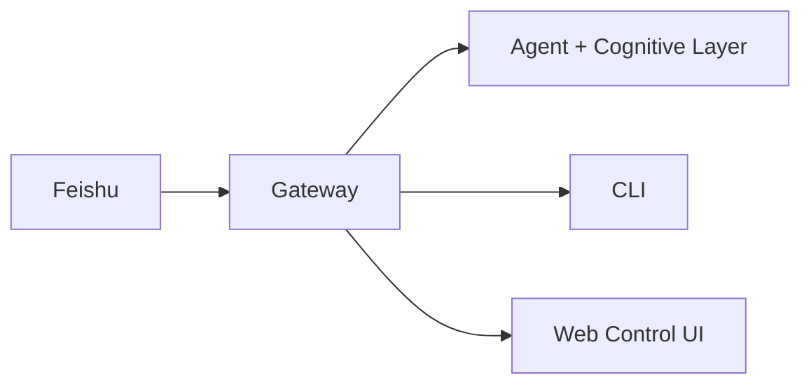

# KaijiBot 🦞

<p align="center">
    
    
</p>

> _"EXFOLIATE! EXFOLIATE!"_ — A space lobster, probably

<p align="center">
  <strong>Self-hosted proactive AI assistant for Feishu, powered by multi-provider LLM backends.</strong><br />
  An AI that doesn't just wait for questions — it learns who you are, thinks about what might interest you, and reaches out proactively with cross-domain insights.
</p>

<Columns>
  <Card title="Get Started" href="/start/getting-started" icon="rocket">
    Install KaijiBot and bring up the Gateway in minutes.
  </Card>
  <Card title="Run Onboarding" href="/start/wizard" icon="sparkles">
    Guided setup with `kaijibot onboard` and pairing flows.
  </Card>
  <Card title="Open the Control UI" href="/web/control-ui" icon="layout-dashboard">
    Launch the browser dashboard for chat, config, and sessions.
  </Card>
</Columns>

## What is KaijiBot?

KaijiBot is a **self-hosted proactive AI assistant** built on [OpenClaw](https://github.com/openclaw/openclaw), tailored for Chinese users with deep Feishu integration. It connects to **62+ extensions** covering 35+ LLM providers — Z.AI (智谱 GLM), DeepSeek, Qwen (通义千问), Anthropic, Google, OpenRouter, and more — through a single Gateway, and adds a **cognitive AI layer** that makes the assistant genuinely proactive.

**Who is it for?** Developers and power users who want an AI partner that knows them, learns their interests, and initiates conversations with relevant insights — all running on their own hardware.

**What makes it different?**

- **Proactive cognitive AI** — builds a per-user persona, generates cross-domain insights, and decides when to reach out based on learned trust and preferences
- **Feishu-native** — deep integration with Feishu via WebSocket long-connection and event subscription (the only messaging channel)
- **Multi-provider LLM** — 35+ providers: Z.AI (GLM), DeepSeek, Qwen, Kimi, MiniMax, 百度千帆, 阶跃星辰, 火山引擎, BytePlus, Anthropic Claude, Google Gemini, OpenRouter, LiteLLM, Ollama, and more
- **Self-hosted**: runs on your hardware, your rules — no data leaves your machine unless you configure search providers
- **Open source**: MIT licensed, based on the OpenClaw platform

**What do you need?** Node 22+ (Node 24 recommended), an API key from any supported provider (Z.AI recommended), a Feishu bot app, and 5 minutes.

## How it works



The Gateway is the single source of truth for sessions, routing, and channel connections. The cognitive layer runs alongside the agent loop, building user personas and generating proactive insights.

## Key capabilities

<Columns>
  <Card title="Feishu Integration" icon="message-square">
    Full Feishu channel with WebSocket long-connection, event subscription, rich messages, and media support.
  </Card>
  <Card title="Cognitive AI Layer" icon="brain">
    Per-user persona learning, cross-domain insight generation, trust-aware proactive scheduling, and preference adaptation.
  </Card>
  <Card title="Multi-Provider LLM" icon="cpu">
    Z.AI (智谱 GLM) as primary, plus OpenAI, Ollama, and LMStudio — switch providers with a single config change.
  </Card>
  <Card title="Media & Voice" icon="image">
    Send and receive images, audio, and documents. Speech recognition and TTS synthesis built in.
  </Card>
  <Card title="Web Control UI" icon="monitor">
    Browser dashboard for chat, config, sessions, and monitoring.
  </Card>
  <Card title="Plugin & Skill System" icon="plug">
    21 bundled extensions and 21 skills — memory, search, browser automation, and more. Extensible via SDK.
  </Card>
</Columns>

## Quick start

<Steps>
  <Step title="Install KaijiBot">
    ```bash
    npm install -g kaijibot@latest
    ```
  </Step>
  <Step title="Configure Feishu and LLM provider">
    ```bash
    # Set your LLM API key (Z.AI recommended)
    export ZAI_API_KEY="your-api-key"

    # Configure Feishu channel
    kaijibot config set channels.feishu.appId "your-app-id"
    kaijibot config set channels.feishu.appSecret "your-app-secret"
    ```
  </Step>
  <Step title="Start and chat">
    ```bash
    kaijibot gateway --port 18789 --verbose
    ```

    Open Feishu, find your bot, and send a message. KaijiBot will start building your cognitive persona automatically — after a few conversations it begins proactive outreach with tailored insights.

  </Step>
</Steps>

Need the full install and dev setup? See [Getting Started](/start/getting-started).

## Dashboard

Open the browser Control UI after the Gateway starts.

- Local default: [http://127.0.0.1:18789/](http://127.0.0.1:18789/)
- Remote access: [Web surfaces](/web) and [Tailscale](/gateway/tailscale)

## Configuration (optional)

Config lives at `~/.kaijibot/kaijibot.json`.

- If you **do nothing**, KaijiBot uses Z.AI GLM with per-sender sessions and the cognitive layer enabled.
- To customize, set Feishu access controls or cognitive parameters.

Example:

```json5
{
  channels: {
    feishu: {
      appId: "cli_xxxx",
      appSecret: "xxxx",
    },
  },
  cognitive: {
    enabled: true,
    proactive: {
      enabled: true,
      minIntervalHours: 4,
      activeHours: { start: "09:00", end: "22:00" },
    },
  },
}
```

## Start here

<Columns>
  <Card title="Docs hubs" href="/start/hubs" icon="book-open">
    All docs and guides, organized by use case.
  </Card>
  <Card title="Configuration" href="/gateway/configuration" icon="settings">
    Core Gateway settings, tokens, and provider config.
  </Card>
  <Card title="Remote access" href="/gateway/remote" icon="globe">
    SSH and tailnet access patterns.
  </Card>
  <Card title="Feishu Channel" href="/channels/feishu" icon="message-square">
    Feishu bot setup, event subscription, and message handling.
  </Card>
  <Card title="Cognitive Layer" href="/concepts/cognitive-overview" icon="brain">
    Persona, insights, proactive scheduling, trust models, and feedback loop.
  </Card>
  <Card title="Help" href="/help" icon="life-buoy">
    Common fixes and troubleshooting entry point.
  </Card>
</Columns>

## Learn more

<Columns>
  <Card title="Full feature list" href="/concepts/features" icon="list">
    Complete channel, routing, and media capabilities.
  </Card>
  <Card title="Multi-agent routing" href="/concepts/multi-agent" icon="route">
    Workspace isolation and per-agent sessions.
  </Card>
  <Card title="Security" href="/gateway/security" icon="shield">
    Tokens, allowlists, and safety controls.
  </Card>
  <Card title="Troubleshooting" href="/gateway/troubleshooting" icon="wrench">
    Gateway diagnostics and common errors.
  </Card>
  <Card title="About and credits" href="/reference/credits" icon="info">
    Project origins, contributors, and license.
  </Card>
</Columns>
